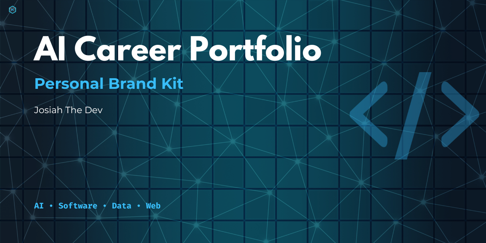

# Canva Personal Skills Advertising Kit

## Project Overview

This project is a personal skills advertising kit created using Canva for my public brand, **Josiah The Dev**.

The purpose of this project is to show how I can use Canva to create clean digital advertising assets for my skills across Instagram, X, YouTube, WhatsApp, TikTok, and GitHub.

## Brand Name

**Josiah The Dev**

## Skills Advertised

- AI
- Coding
- Web Development
- Social Media Management
- Graphic Design
- Video Editing

## Assets Created

### Brand Board

- Brand guide PDF
- Brand guide PNG

### Logo Assets

- Personal logo
- Icon-only logo
- Tech portfolio logo

### GitHub Asset

- GitHub project banner

### Social Media Ads

- Instagram skills ad
- X skills ad
- WhatsApp status skills ad

### Profile Banners

- YouTube channel banner
- X profile banner

### Video Asset

- TikTok short skills promo video

## Tools Used

- Canva
- GitHub
- Markdown

## Skills Demonstrated

- Canva design
- Personal branding
- Social media advertising design
- Logo customization
- YouTube banner design
- X banner design
- WhatsApp status design
- Short-form video design
- Visual communication
- Digital content creation

## Career Relevance

This project shows how I can create digital advertising content for my own brand and future clients.

It connects to my career direction in AI, coding, web development, social media management, graphic design, and video editing.

## Author

Created by **Josiah The Dev**